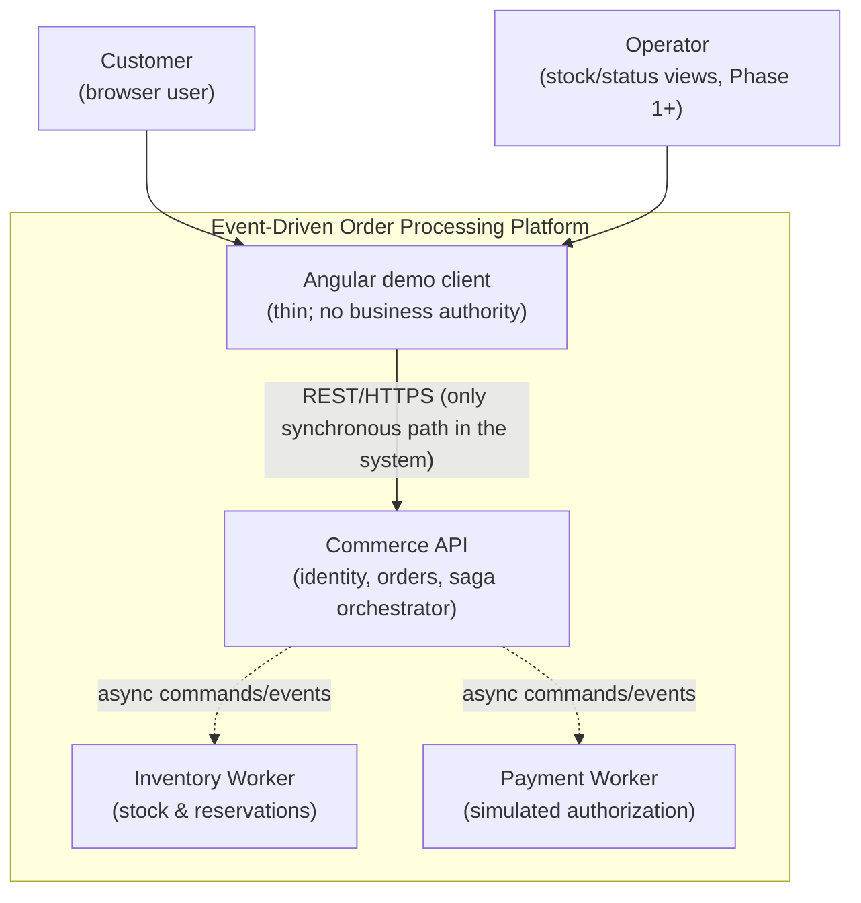
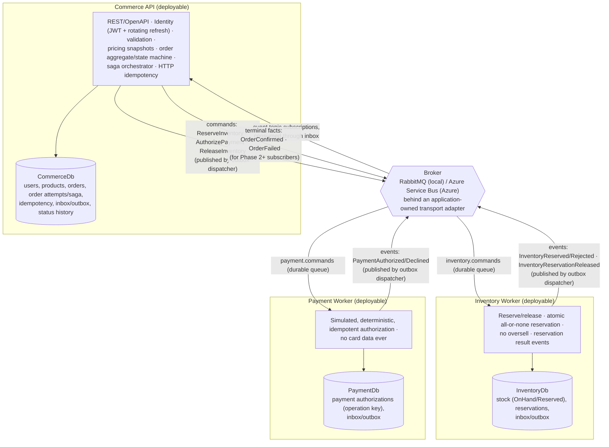

# Architecture

This document reflects [`PLAN.md`](PLAN.md) (the authoritative source) at the C4 context and
container levels, per PLAN.md §10–§18 and the documentation strategy §25. **Current repository
state: Phase 1.** The Commerce Order domain model and state tests exist; service hosts and the
distributed runtime topology below remain planned scaffolds until their roadmap phases.

## Context (C4 Level 1)

External actors interact with the platform only through the Angular client → Commerce API REST
boundary. Inter-service workflow is exclusively asynchronous through the broker (PLAN.md §10
Communication and Integration Boundaries). No synchronous Commerce→Inventory/Payment calls exist
in the order workflow.

## Containers (C4 Level 2)

(Diagram note: solid edges = asynchronous message flow through the broker; queue/topic names follow
PLAN.md §15 topology — durable service command queues `inventory.commands` / `payment.commands` and
a durable event exchange/topic with per-service subscriptions. Database ownership arrows are inside
each deployable container.)

## Boundaries and ownership (PLAN.md §10–§11)

| Component | Owns | Never owns |
|---|---|---|
| Commerce API | CommerceDb: identity, sellable products, orders, saga/attempts, HTTP idempotency, its inbox/outbox | Inventory/Payment data; shared business logic |
| Inventory Worker | InventoryDb: stock counters (`OnHand`/`Reserved`, `0 <= Reserved <= OnHand`), reservations, its inbox/outbox | Order state; payment state |
| Payment Worker | PaymentDb: simulated authorization operations keyed by unique operation key, its inbox/outbox | Card data (does not exist anywhere), order state |
| Broker | Durable transport only — never business truth | — |
| BuildingBlocks | Transport abstractions, versioned integration contracts, telemetry primitives | Domain entities, EF mappings, business rules |

Database-per-service is enforced in code layout: no project from one service folder references
another service's projects, and no cross-database joins/foreign keys exist. Local SQL may host
three databases on one container (and Azure may use one logical server) — that is **logical**
isolation with separate credentials, not independent compute failure isolation.

## Consistency and failure semantics (PLAN.md §16–§18)

- **Transactional outbox** in every publisher: state change + outgoing message commit in one local
  SQL transaction; a dispatcher publishes with confirms afterwards. Crashes cause duplicates, never
  lost commitments.
- **Transactional inbox** in every consumer: unique `(ConsumerName, MessageId)` claim + business
  change + own outbox write in one transaction; the broker message is acknowledged only after
  commit.
- **At-least-once delivery + idempotent consumers** with business operation keys
  (order/attempt). The platform never claims exactly-once semantics.
- Bounded retries with backoff/jitter; business rejections (`InventoryRejected`,
  `PaymentDeclined`) are durable result events, not exception loops; poison messages dead-letter
  with diagnostics. Compensation (`ReleaseInventory`) is a new idempotent command — committed work
  is never rolled back; a payment timeout is reconciled, not treated as decline.
- Order lifecycle (MVP): `PendingInventory → PendingPayment → Confirmed`, `Failed` from either
  stage with compensation. Submission returns `202 Accepted` after durable commit; acceptance is
  not completion.

## Key trade-offs (summary; rationale lives in the ADRs)

| Decision | Chosen | Rejected | Why |
|---|---|---|---|
| Architecture style | Small SOA: modular Commerce + two workers | Monolith; service-per-domain-noun | Independent ownership/failure demos without synchronous hops or operational sprawl (ADR-001) |
| Boundaries | Commerce/Inventory/Payment with own DBs | Shared database; shared domain library | Enforces async consistency and failure isolation (ADR-002, §11) |
| Delivery | At-least-once + inbox/idempotency | Exactly-once claims; broker dedupe as correctness | Redelivery is inevitable; correctness must not depend on broker windows (§15, §18) |
| Broker | RabbitMQ local, Azure Service Bus hosted, narrow adapter | One broker everywhere; heavy abstraction | Local DX vs managed cloud, semantics kept visible and tested (ADR-004, future) |
| Runtime | Azure Container Apps | Kubernetes | Plan-excluded complexity for a single-region MVP (§28) |

## Where each piece lands in the roadmap

Commerce Order domain/value objects/state transitions are implemented in Phase 1 (M1-01), with
unit tests and detail in `docs/architecture/order-domain.md`. Other projects remain build-wired
scaffolds. Integration contracts → Phase 1 · schemas/migrations → Phase 2 · identity/auth → Phase 3 · order
acceptance API → Phase 4 · messaging adapters → Phase 5 · outbox → 6 · inbox → 7 · inventory → 8 ·
payment simulator → 9 · saga/compensation → 10 · observability → 11 · test hardening → 12 ·
Docker/Compose → 13 · CI gates → 14 · Azure → 15 · Angular client → 16 · portfolio/docs hardening →
17. `SECURITY.md`, `API.md`, and database/messaging/operations docs are created with those phases
(PLAN.md §25) and intentionally do not exist yet.
