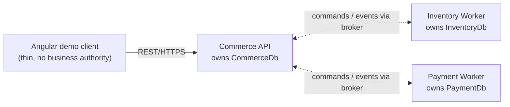

# Event-Driven Order Processing Platform

A production-oriented, portfolio-grade order processing platform demonstrating backend engineering,
distributed systems, event-driven architecture, messaging reliability, security, observability,
testing, and Azure deployment. A customer submits an order; the platform reserves stock,
authorizes a simulated payment, and reports a durable order outcome — correctly, even when
services, databases, or the broker fail or deliver messages more than once.

**Status: Phase 0 — repository and architecture foundation (M0).** The repository contains an empty,
buildable .NET solution scaffold, GitHub contribution templates, and a minimal PR validation workflow.
The workflow validates restore/build/test; run results are available in GitHub Actions. No business
behavior, API endpoints, database schemas, or messaging implementations exist yet; they are introduced
phase by phase per [`PLAN.md`](PLAN.md).

## Architecture at a glance

Three independently deployable backend services, each owning its own SQL Server database,
coordinating asynchronously through a broker with a transactional outbox/inbox and at-least-once
delivery. The full, authoritative description is in [`PLAN.md`](PLAN.md) and
[`ARCHITECTURE.md`](ARCHITECTURE.md); this is the context view:



Key non-negotiables (see PLAN.md §10–§18): database-per-service, no synchronous service-to-service
calls in the order workflow, transactional outbox + inbox, idempotent consumers, at-least-once
delivery (never exactly-once claims), integer minor-unit money with currency, UTC timestamps.

## Prerequisites

- [.NET SDK](https://dotnet.microsoft.com/download/dotnet) **10.0.401 or a newer 10.0 feature
  band**, as pinned in [`global.json`](global.json) (`rollForward: latestFeature`).
- Any editor that honors [`.editorconfig`](.editorconfig) (Visual Studio, VS Code, Rider, or the CLI).
- No databases, brokers, or containers are required yet; the local Docker/Compose stack arrives in
  PLAN.md Phase 13.

## Build and test

From the repository root:

```bash
dotnet restore OrderProcessingPlatform.sln
dotnet build OrderProcessingPlatform.sln
dotnet test OrderProcessingPlatform.sln
```

The build enforces nullable reference types, .NET analyzers (`latest-recommended`), code-style
rules from `.editorconfig`, central package versions (`Directory.Packages.props`), and
warnings-as-errors. The test suite currently contains only per-project harness placeholders that
prove the xUnit wiring for each test boundary; real tests are added from Phase 1 onward.

## Repository layout

Per PLAN.md §24 (directories not yet needed by Phase 0 are intentionally absent and are added with
their owning phase):

```text
.
├── README.md · PLAN.md · ARCHITECTURE.md · CONTRIBUTING.md
├── global.json · Directory.Build.props · Directory.Packages.props · .editorconfig
├── OrderProcessingPlatform.sln
├── src/
│   ├── BuildingBlocks/   # Messaging.Abstractions · Messaging.Contracts · Observability
│   ├── Commerce/         # Commerce.Api · Application · Domain · Infrastructure
│   ├── Inventory/        # Inventory.Worker · Application · Domain · Infrastructure
│   └── Payments/         # Payments.Worker · Application · Domain · Infrastructure
├── tests/
│   ├── Commerce.UnitTests · Commerce.IntegrationTests
│   ├── Inventory.UnitTests · Inventory.IntegrationTests
│   ├── Payments.UnitTests · Payments.IntegrationTests
│   └── Contracts.Tests · EndToEnd.Tests
└── docs/
    └── adr/              # ADR template + ADR-001/002 (see docs/adr/README.md)
```

## Documentation

- [`PLAN.md`](PLAN.md) — authoritative scope, architecture, roadmap, and acceptance criteria.
- [`ARCHITECTURE.md`](ARCHITECTURE.md) — context/container diagrams, boundaries, data ownership,
  failure semantics, trade-offs.
- [`CONTRIBUTING.md`](CONTRIBUTING.md) — setup, conventions, PR process, Definition of Done.
- [`docs/adr/`](docs/adr/README.md) — architecture decision records (ADR-001, ADR-002 recorded as
  pending approval of decisions already fixed by PLAN.md).
- `SECURITY.md`, `API.md`, database/messaging/operations docs, and runbooks are created with their
  owning phases (PLAN.md §25); referencing them before they exist would be premature.

## Limitations (honest current state)

- Empty project scaffolds only — the hosts build and start but expose no endpoints and run no work.
- **M0 baseline status:** Git initialization and `.gitignore` are established (verified in
  `docs/current-state.md`, task M0-GIT-01); the scaffold passed clean-clone build/test review
  (M0-01A); M0-01B provides PR/issue templates and minimal PR validation CI. The workflow runs
  restore/build/test only; GitHub Actions records runs in the repository's Actions tab.
  Expanded quality/security gates remain in their planned later phases.
- No license has been selected yet: the repository has **no licensing decision on record**, so no
  `LICENSE` file is included (it would itself be an unapproved decision). This is flagged to the
  human owner for an explicit choice; see `CONTRIBUTING.md`.

## Demo

The runnable demo (order submission → reservation → simulated payment → durable outcome) exists
from PLAN.md Phase 10+ and is documented when it exists; no demo is possible at Phase 0.
