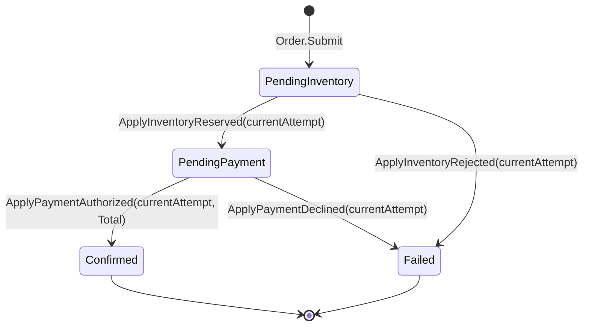

# Order Domain — Aggregate, Value Objects, and Lifecycle

- **Task:** M1-01 (Phase 1 — Domain and Contracts, M1 Secure Order Acceptance workstream)
- **Date:** 2026-10-07
- **Owner service:** Commerce. These types live only in `src/Commerce/Commerce.Domain/Orders`
  (`namespace Commerce.Domain.Orders`) and are referenced only from Commerce projects.
- **Relates to:** PLAN.md §8 (Domain Model and Invariants), §9 (Order Lifecycle and State Machine),
  §18 (Delivery Semantics), §22 (Unit Tests), §24 (Conventions), §31 (Phase 1)
- **Code:** `Order`, `OrderStatus`, `OrderLineSnapshot`, `Money`, `Quantity`, `Sku`, `OrderId`,
  `CustomerId`, `OrderTransitionOutcome`, `OrderTransitionResult`
- **Tests:** `tests/Commerce.UnitTests/Orders/` (`OrderSubmissionTests`, `OrderInvariantTests`,
  `OrderTransitionTests`, `OrderLineSnapshotTests`, `MoneyTests`, `ValueObjectTests`, `TestOrders`
  builders)

## Boundary and ownership

`Order` is the Commerce aggregate root. It owns the customer-visible order lifecycle and is the
only place that decides whether a reported workflow result changes order state. Nothing else may
mutate it: `Status` has a private setter, `Total` and `Lines` are derived at construction, and the
only mutating members are the four `Apply…` methods, which *report results* rather than command
transitions. Neither HTTP clients nor other services hold authoritative order state (PLAN.md §6,
§8).

Inventory and Payment own their own aggregates (reservations, authorizations) in their services;
no type here references them, a database, a broker, or a message envelope. Cross-service
coordination is the saga's job (later phases), always via messages and each service's own
transaction (PLAN.md §9 "Saga Behavior", §10).

## Shape of the aggregate

| Member | Type | Notes |
|---|---|---|
| `Id` | `OrderId` | Opaque non-empty `Guid` value object. |
| `CustomerId` | `CustomerId` | Submitting principal; identity data itself is never copied (PLAN.md §8). |
| `Lines` | `IReadOnlyList<OrderLineSnapshot>` | Caller's collection is **copied** at construction and exposed as a read-only wrapper; lines cannot change after submission (PLAN.md §8). |
| `Total` | `Money` | Derived: sum of line totals under `checked` arithmetic. Never supplied by a caller. |
| `Status` | `OrderStatus` | `PendingInventory` \| `PendingPayment` \| `Confirmed` \| `Failed`; changed only by `Apply…`. |
| `CurrentAttempt` | `int` | The attempt whose results are authoritative. The aggregate only reads it; opening a new attempt belongs to the saga (later phase). |
| `IsTerminal` | `bool` | True for `Confirmed` and `Failed` (PLAN.md §9). |

Construction seams:

- `Order.Submit(orderId, customerId, lines)` — creates a newly submitted order in
  `PendingInventory` at `InitialAttempt` (1). This is the domain half of `POST /v1/orders`
  (PLAN.md §9 row "None → PendingInventory"); its idempotency record, saga state, and
  `ReserveInventory` outbox command are persistence-phase companions and are intentionally not
  modelled here.
- `Order.Rehydrate(orderId, customerId, lines, status, currentAttempt)` — rebuilds the aggregate
  from state the owning service already holds (Phase 2 persistence seam; also what makes
  superseded-attempt states reachable in tests). It is not a lifecycle capability: the status and
  attempt are checked, the lines are re-validated, and the **total is recomputed from the lines**, so
  a stored total can never disagree with the lines it claims to sum; the shared private constructor
  then rechecks the identifiers. Stored state cannot bypass the §8 invariants.

## Value objects and invariants (PLAN.md §8)

All value objects validate at construction **and recheck at the boundary that consumes them**. The
recheck is not optional: every one of these types is a `readonly record struct`, so its `default`
value exists without any constructor running — `default(OrderId)` has `Guid.Empty`,
`default(Quantity)` is zero, and `default(Money)`/`default(Sku)` carry `null` text. Members are
get-only, so nothing can mutate a value afterwards, but a caller can still hand an aggregate or a
line the uninitialized struct. Each type therefore exposes `IsValid` (true exactly for the value its
constructor would have produced), and consumers that receive a value they did not create call it.
Money is integer minor units plus an ISO 4217 alphabetic code — never binary floating point (§24).
The minor-unit scale of a code is a property of the currency and is resolved by Commerce's
sellable/pricing data, not by the `Money` type.

- `Money(long amountMinor, string currency)` — `amountMinor >= 0`; currency trimmed, uppercased,
  exactly three `A–Z` letters. `Add` requires the same currency and sums with `checked`;
  `Multiply(int factor)` products are `checked`. A negative factor on a nonzero amount therefore
  either fails the constructor's non-negative invariant or throws `OverflowException` — it can never
  produce a debit-shaped value. A zero amount times any factor remains valid zero money.
  `default(Money)` is invalid and is rejected by `IsValid`, because a null
  currency compares equal to no real code.
- `Quantity(int value)` — strictly positive, bounded by the `int` range; combined with the
  `checked` multiply, an implausible quantity produces a correct product or fails fast, never a
  wrapped total. `default(Quantity)` is zero and fails `IsValid`. Tighter request-level caps are API
  validation (PLAN.md §12), not domain rules.
- `Sku(string value)` — trimmed, non-blank; comparison is ordinal (no invented case folding or
  length rules PLAN.md does not state). `default(Sku)` has no text at all and fails `IsValid`.
  Catalog existence/activeness is checked by the submission workflow, not by this type.
- `OrderId` / `CustomerId` — non-empty `Guid`s as distinct types so identities cannot be confused
  at call sites; `default` of either is `Guid.Empty` and fails `IsValid`.
- `OrderLineSnapshot(sku, displayName, quantity, unitAmount)` — every argument is rechecked
  (`sku.IsValid`, trimmed non-blank name, `quantity.IsValid`, `unitAmount.IsValid`) before the line
  total is derived, so a snapshot cannot be built around a default value object; `LineTotal =
  quantity × unitAmount` is computed once under `checked` arithmetic and is never caller-supplied.

Order-level invariants enforced by `Submit`/`Rehydrate` (PLAN.md §8), in the order the aggregate
actually evaluates them:

1. `Rehydrate` only — `status` must be a defined `OrderStatus`, and `currentAttempt` must be at least
   `InitialAttempt`.
2. The lines are validated and copied: the collection is non-null and holds at least one line (total
   and currency are undefined without one), and **every line is a valid snapshot** (`IsValid`), which
   is what rejects `default(OrderLineSnapshot)`.
3. The copied lines use exactly **one currency**.
4. The total is then computed from those validated lines under `checked` arithmetic.
5. Finally the private constructor — the single boundary shared by both factories — rechecks the
   `OrderId` and `CustomerId` and asserts that the derived total is valid money.

A rejected call creates no aggregate. Step 2 runs before steps 3–4 on purpose: an uninitialized line
used to agree with itself on currency (`null == null`) and the derived total came out as
`default(Money)`, producing an accepted order that `ApplyPaymentAuthorized` could never match — an
order that was permanently unconfirmable. Note the consequence of placing the identifier recheck at
the shared constructor instead of duplicating it in both factories: an identifier-rejection can be
pre-empted by an `OverflowException` from step 4 when the lines also overflow. Either way nothing is
constructed; only which exception reaches the caller differs.

## Lifecycle state machine (PLAN.md §9)

`Confirmed` and `Failed` are terminal for the initial workflow; `Processing`, `Shipped`,
`Completed`, and `Cancelled` are deliberately absent (Cancelled is Phase 2, subject to
compensation; PLAN.md §9). An order may not reach `Confirmed` until both reservation and payment
authorization succeeded — encoded by requiring `PendingPayment` (only reachable via
`ApplyInventoryReserved`) as the source state of `ApplyPaymentAuthorized` (PLAN.md §8).

Mapping to the PLAN.md §9 table rows: the four `Apply…` methods are exactly the domain halves of
the four async consumer-driven rows (`InventoryReserved`, `InventoryRejected`,
`PaymentAuthorized`, `PaymentDeclined`). Timeout/compensation-pending rows are saga policy, and
the event emission each row describes (`AuthorizePayment`, `OrderConfirmed`, `OrderFailed`,
`ReleaseInventory`) is outbox/saga work in later phases — the aggregate records state and returns
a result; it publishes nothing.

Payment confirmation additionally requires the reported authorization to **equal the order's own
`Total` in amount and currency** ("Must match order, attempt, amount, currency, and current
state"). A mismatch confirms nothing and does not lock the order: a later correct authorization can
still confirm it, and the mismatched report is the caller's signal to reconcile or fail
deliberately.

## Guard semantics: at-least-once results are data, not exceptions

Delivery is at-least-once (PLAN.md §18), so duplicates, redeliveries, and results from a
superseded attempt are *expected inputs*. Every `Apply…` call therefore runs one shared guard and
returns an `OrderTransitionResult` (`Outcome`, `StatusBefore`, `StatusAfter`); only
`Applied` mutates, and for every other outcome `StatusBefore == StatusAfter ==` the unchanged
current status. Guard evaluation order is fixed:

1. `attempt < CurrentAttempt` → `IgnoredStaleAttempt` — a result from a superseded attempt can
   never act on the current workflow (PLAN.md §9: order/attempt/version checks prevent stale
   messages changing current state). Checked **before** status and amount, so a stale-and-mismatched
   result is classified as stale, never as a mismatch or a state error.
2. `attempt > CurrentAttempt` → `IgnoredFutureAttempt` — data inconsistent with this aggregate;
   the caller surfaces it for reconciliation/alerting instead of acting on it.
3. `Status == target` → `IgnoredDuplicate` — the result's outcome is already recorded
   (redelivery). Classification is by resulting state, which is deliberately safe: after a
   rejection failed the order, a late decline also reports `IgnoredDuplicate` — nothing changes
   either way, and distinguishing message provenance is the inbox's job (later phase), not the
   aggregate's.
4. `Status != expectedFrom` → `IgnoredOutOfOrder` — arrived too early (authorization before the
   reservation) or would regress a terminal order.
5. Otherwise → `Applied(previous → target)`.

Malformed attempt numbers (0, negative) fall out of these branches as no-ops; they never throw and
never mutate.

The two error channels are intentionally separate:

- **Construction-time invariant violations fail fast** with `ArgumentNullException`,
  `ArgumentException`, `ArgumentOutOfRangeException`, or `OverflowException` (checked arithmetic)
  — these indicate a programming or validation error upstream.
- **Malformed workflow results never throw** — ignoring them safely is correct behavior under
  at-least-once delivery, and the caller (consumer/saga, later phases) records the outcome and
  acknowledges rather than retrying an exception.

`OrderTransitionOutcome` is also the domain's small result convention for lifecycle outcomes.
Domain events vs integration messages (PLAN.md §8): none of these types is a broker contract;
versioned envelopes are a separate Phase 1 contracts task, and internal CLR types are never
exposed as contracts.

## Explicitly out of scope (later phases — not fabricated here)

- Persistence attributes, EF configuration, timestamps, concurrency tokens, status history
  (Phase 2/4); the `Rehydrate` total-recompute rule anticipates the constraint that stored totals
  must equal their lines.
- Message envelope, `IdempotencyKey`, outbox/inbox writes, `OrderConfirmed`/`OrderFailed` emission
  (contracts task, Phases 5–7).
- Saga attempt opening, timeout/reconciliation policy, `ReleaseInventory` compensation, failure
  reason codes (saga phases).
- `Cancelled` lifecycle state and any fulfillment states (Phase 2+).

## Test coverage (PLAN.md §22 — unit tests)

`tests/Commerce.UnitTests/Orders/` (xUnit, deterministic fixed-Guid builders in `TestOrders`):

- **Totals:** line total = quantity × unit amount; order total = sum of line totals; zero-priced
  orders total zero; big products exact; overflow throws instead of wrapping (Money, line, order).
- **Invalid inputs:** negative amounts, blank/misshapen currency codes, non-positive quantities,
  blank SKUs/display names, empty `Guid` ids, null/empty/mixed-currency line collections,
  undefined status or sub-initial attempt on `Rehydrate`, and — because value types have a `default`
  that never runs a constructor — `default(OrderLineSnapshot)` as a sole or mixed-in line and
  `default(OrderId)`/`default(CustomerId)` on both `Submit` and `Rehydrate` (`OrderInvariantTests`),
  plus `default` value objects passed into the line constructor.
- **Valid transitions:** all four plan-valid moves, the full happy path through every MVP state,
  and success on a non-initial current attempt.
- **Invalid/duplicate/stale/future outcomes:** every no-op branch per transition, repeated
  redelivery loops, terminal orders immune to all results, attempt guard precedence over amount
  mismatch, and assertions that non-`Applied` results never change status, total, currency, or
  lines.
- **Immutability/encapsulation:** caller collection copied; exposed view not downcastable and
  rejects writes; `Status`/`Total` expose no public setter (reflection-checked).
